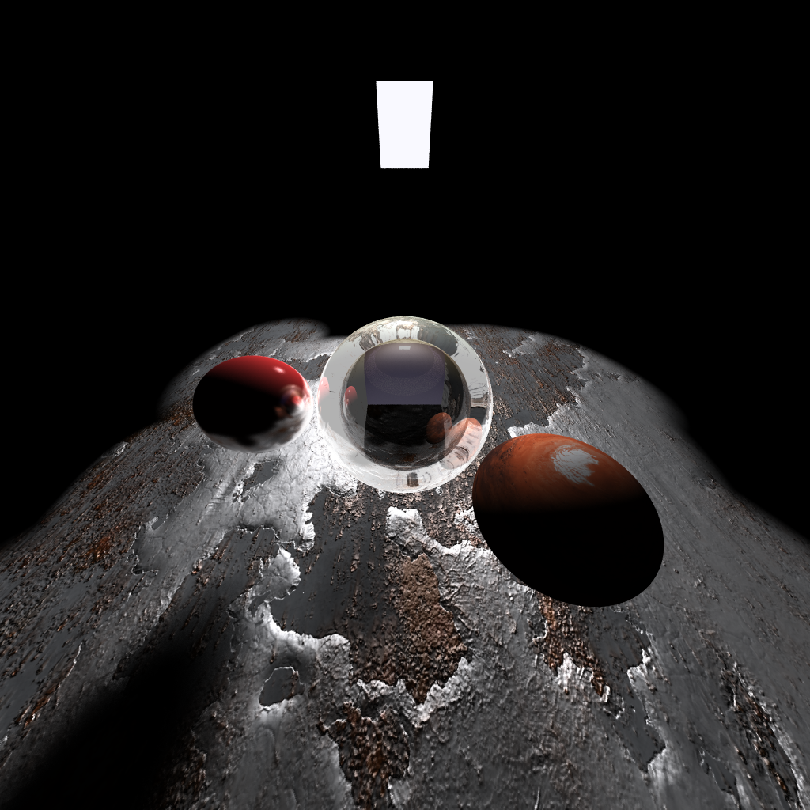
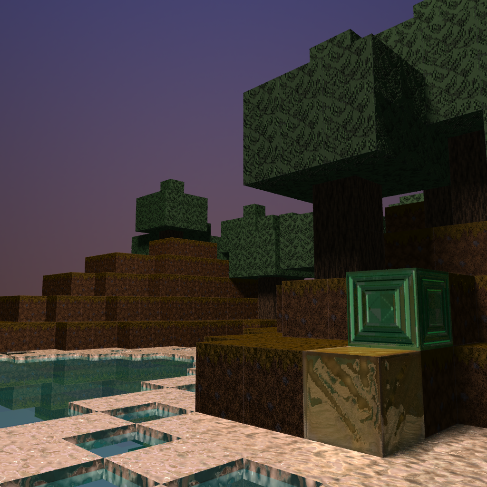
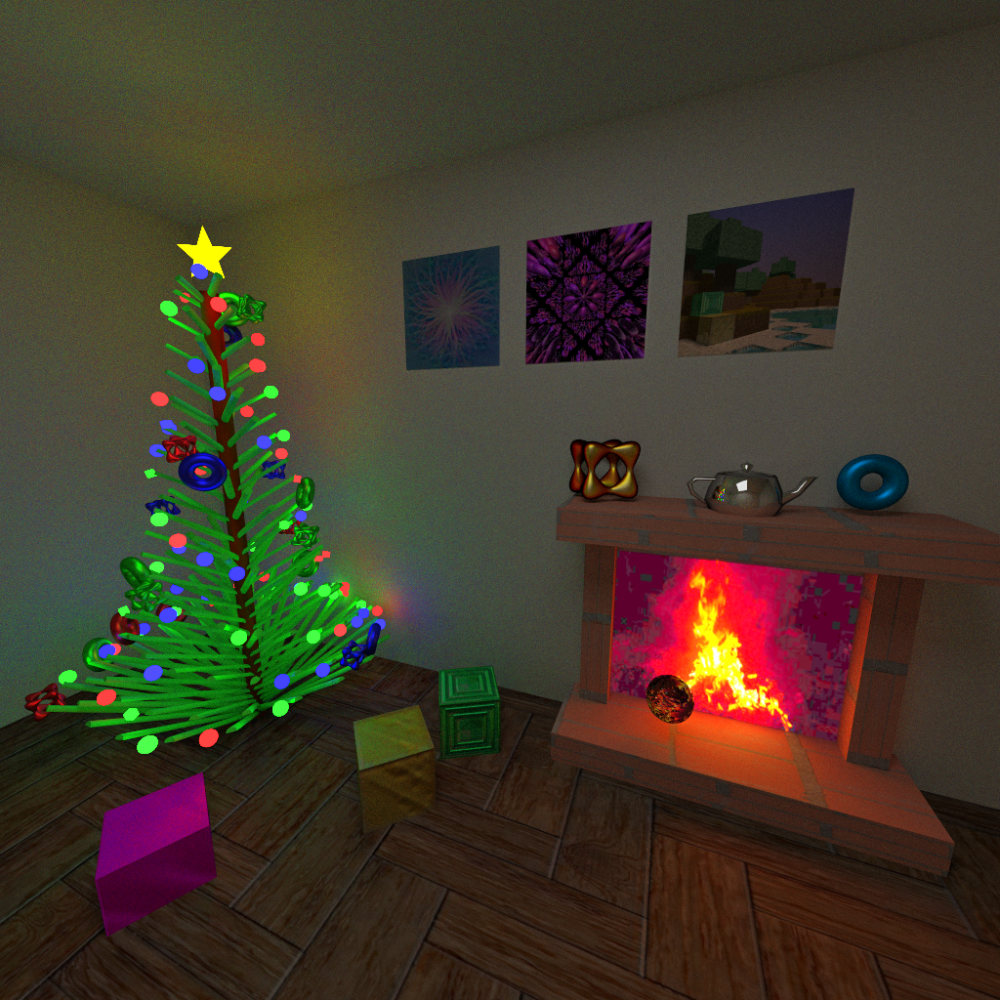

Course work for my CSCD18: Introduction to Computer Graphics class. In this
course we built a 2D light renderer, a ray tracing engine using an extended
Phong model and a path tracer.

 

Here are some renders that my partner and I created throughout the term:

